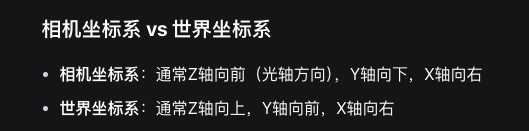

首先使用了yolo或者传统来对装甲板进行识别 
在识别过程中先是对装甲板的yaw进行选择
然后要确定装甲板坐标系的方向和定义
有一下几个重点:
const std::vector<cv::Point3f> BIG_ARMOR_POINTS{
  {0, BIG_ARMOR_WIDTH / 2, LIGHTBAR_LENGTH / 2},
  {0, -BIG_ARMOR_WIDTH / 2, LIGHTBAR_LENGTH / 2},
  {0, -BIG_ARMOR_WIDTH / 2, -LIGHTBAR_LENGTH / 2},
  {0, BIG_ARMOR_WIDTH / 2, -LIGHTBAR_LENGTH / 2}};
const std::vector<cv::Point3f> SMALL_ARMOR_POINTS{
  {0, SMALL_ARMOR_WIDTH / 2, LIGHTBAR_LENGTH / 2},
  {0, -SMALL_ARMOR_WIDTH / 2, LIGHTBAR_LENGTH / 2},
  {0, -SMALL_ARMOR_WIDTH / 2, -LIGHTBAR_LENGTH / 2},
  {0, SMALL_ARMOR_WIDTH / 2, -LIGHTBAR_LENGTH / 2}};

  然后去网上看
  有可能人家的定义顺序是反的 也有可能是人家的坐标系的定义是反的

但是solvepnp给出的就是世界坐标系下顺序